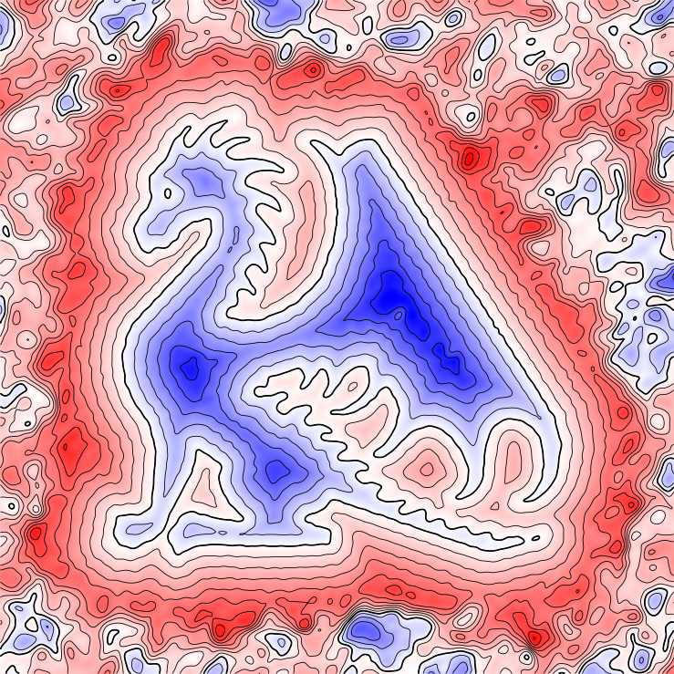
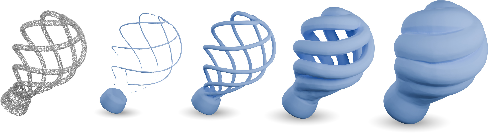

**This library is under construction**.

The implicit lab is a python library for the computation of _implicit neural representations_ (INR) of geometrical objects. It is built on top of [pytorch](https://pytorch.org/) and provides utilities for geometric dataset handling and sampling, neural architecture definitions, training, geometrical request and visualization.


Implicit neural representations are a recent technique for encoding a signal in the parameters of a neural network.
This library focuses of neural representations of surfaces, which are defined as the zero level set of some continuous function over space, like the [signed distance function](https://en.wikipedia.org/wiki/Signed_distance_function).

<p align="center">
    
</p>

<p align="center">
   
</p>

The (WIP) documentation can be found here: [https://GCoiffier.github.io/neural_implicit_lab/](https://GCoiffier.github.io/neural_implicit_lab/)


# Features
The library currently features:  
- Loading, processing and sampling of various input geometry types (point clouds, polylines, surface meshes) to generate relevant training datasets  
- Training of various neural models according to published algorithms  
- Geometrical queries on INRs   

# Installation

To install implicitlab, simply type:

```bash
pip install implicitlab
```


### Dependencies
Implicitlab currently depends on the following libraries:  
- [pytorch](https://pytorch.org/)  
- [deel-torchlip](https://github.com/deel-ai/deel-torchlip)  
- [meshio](https://pypi.org/project/meshio/)  
- [mouette](https://github.com/GCoiffier/mouette)  
- [libigl](https://libigl.github.io/)  
- [triangle](https://pypi.org/project/triangle/)  
- [numpy](https://numpy.org/)  
- [scipy](https://scipy.org/)  
- [scikit-image](https://scikit-image.org/)  
- [matplotlib](https://matplotlib.org/)  
